# Gunman Chronicles: Static Recompilation

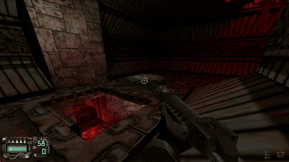

```
   ______                                     ________                      _      __
  / ____/_  ______  ____ ___  ____ _____     / ____/ /_  _________  ____  (_)____/ /__  _____
 / / __/ / / / __ \/ __ `__ \/ __ `/ __ \   / /   / __ \/ ___/ __ \/ __ \/ / ___/ / _ \/ ___/
/ /_/ / /_/ / / / / / / / / / /_/ / / / /  / /___/ / / / /  / /_/ / / / / / /__/ /  __(__  )
\____/\__,_/_/ /_/_/ /_/ /_/\__,_/_/ /_/   \____/_/ /_/_/   \____/_/ /_/_/\___/_/\___/____/
```

Static recompilation of **Gunman Chronicles** (Rewolf Software / Sierra, 2000),
the GoldSrc sci-fi western, from its shipping Win32 binaries to native C.

Built on the [pcrecomp](https://github.com/sp00nznet/pcrecomp) toolchain, and
follows the shared house style of the pcrecomp family of recompilation repos.
The game's history, and the other revival efforts, are in
[docs/HISTORY.md](docs/HISTORY.md) and
[docs/EXISTING_EFFORTS.md](docs/EXISTING_EFFORTS.md).

## Status: **alpha, and playable.**

The recompiled launcher runs the game's own boot from the PE entry point: CRT
and MFC init, registry, the CD-key check, the RAM check, the Sierra and Rewolf
intro movies, the main menu. *New game* loads the engine and the game DLLs,
and the game plays. Our first playthrough ran for 81 minutes, through the
opening on the ship, shutting down the rogue AI, the fall to the planetoid, the
first dinosaur mission and the second, into the third: mouse look, weapons,
AI, level transitions, scripted sequences and save/load, at 1280×960.

That playthrough ran every Rewolf module recompiled and the engine as its
original code:

| Module | Role | Functions | Lift errors | Played as |
|---|---|---:|---:|---|
| `gunman.exe` | launcher, intro movies, menus, video, input | 7,650 | 0 | **recompiled** |
| `vgui.dll` | GUI toolkit | 1,668 | 0 | **recompiled** |
| `client.dll` | HUD, weapons, prediction, effects, mouse look | 2,897 | 0 | **recompiled** |
| `gunman.dll` | all game logic: AI, scripting, weapons, the general, the dinosaurs | 5,121 | 0 | **recompiled** |
| `sw.dll` | engine, software renderer | 4,654 | 0 | original (`--native sw.dll`); see below |

So 17,336 of 21,990 functions, all the game's own code, ran as recompiled C.
All five modules lift with **0 errors** (3.39M lines of generated C). Bink,
WON, DirectDraw and Windows are always called natively (see
[docs/architecture.md](docs/architecture.md)).

**Since then, the engine too:** the fully recompiled build, all 21,990
functions, renders the opening textured, and a side-by-side screenshot
matches the original. Getting there took eight lifter fixes, from a `sin` that read its
caller's flags to a span stepper that lost its carry: the table is in
[docs/ingame.md](docs/ingame.md). It hasn't had a long playthrough yet, so
`--native sw.dll` stays documented as the fallback. Scripted runs need an
unlocked, connected desktop: on a locked session DirectDraw can't lock
surfaces and the intro hangs in Bink, the retail game included.

**Known issues** from the playthrough:

- A gate in the general's scene vanishes when you stand close to it, and
  reappears when you back away. The general stands in front of where it should
  be.
- The general's speech starts partway through the line, and he then waits about
  30 seconds before carrying on with his scene.
- The game window has no taskbar button.

The engine drew and mixed everything in that session as original code, so the
first two are in the recompiled game DLLs, or are the original game's own
behaviour. They still need comparing against the retail game in the same spot.

## Screenshots

Fully recompiled, the engine included: 1280×720 widescreen (Hor+), filtered
textures, sharp-bilinear scaling to a maximized window:

| | |
|---|---|
| 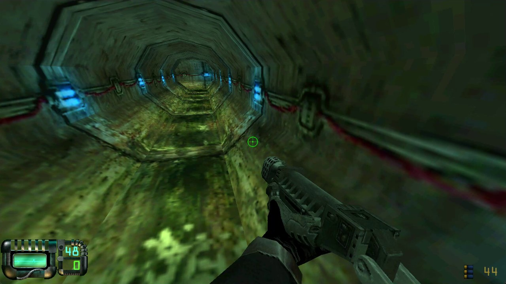 | 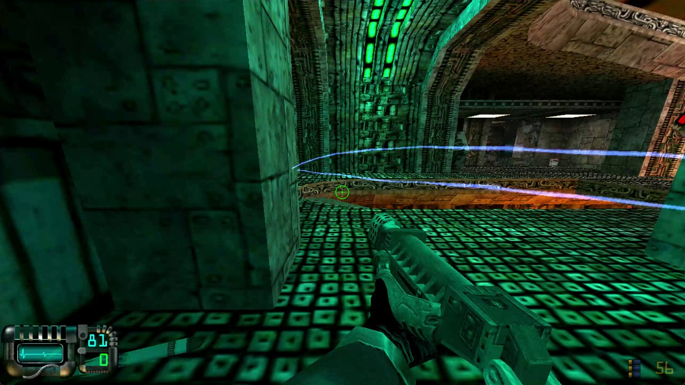 |
| 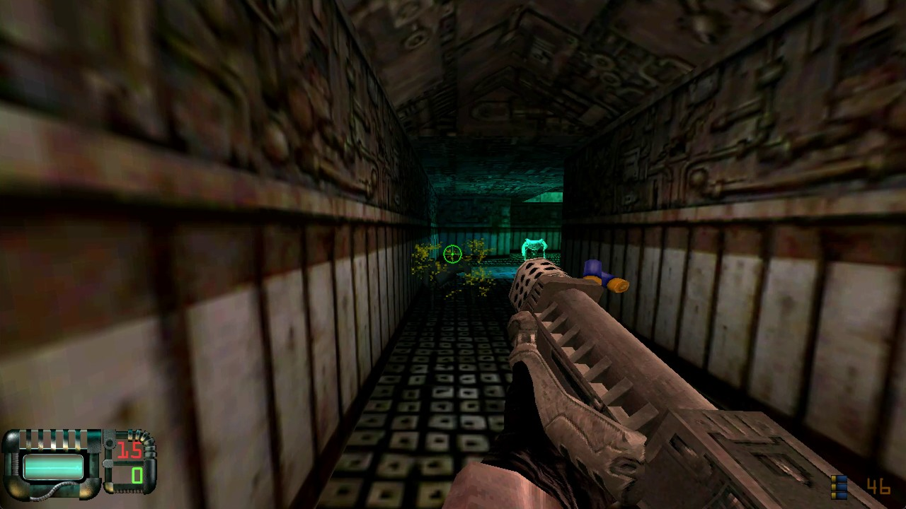 | 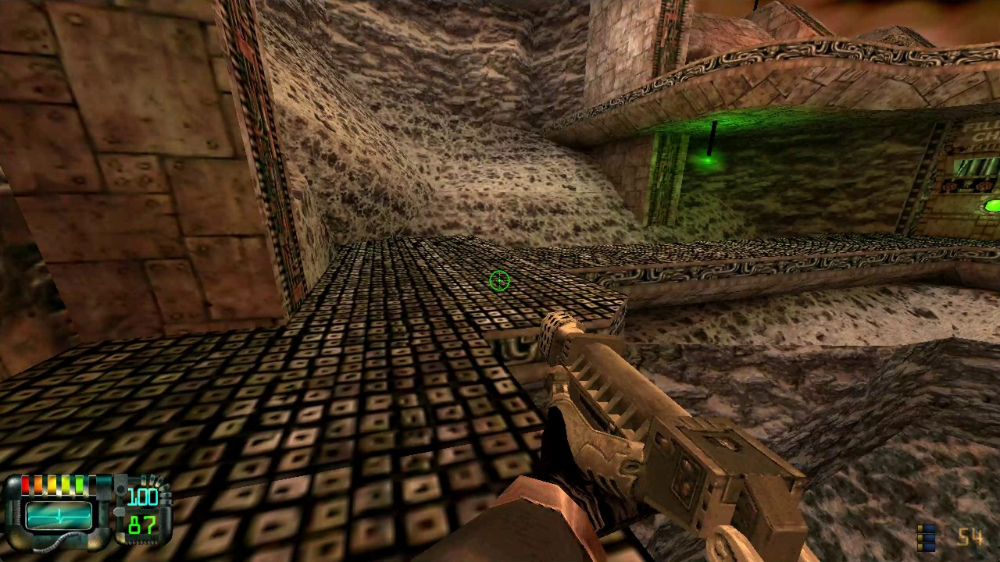 |
| 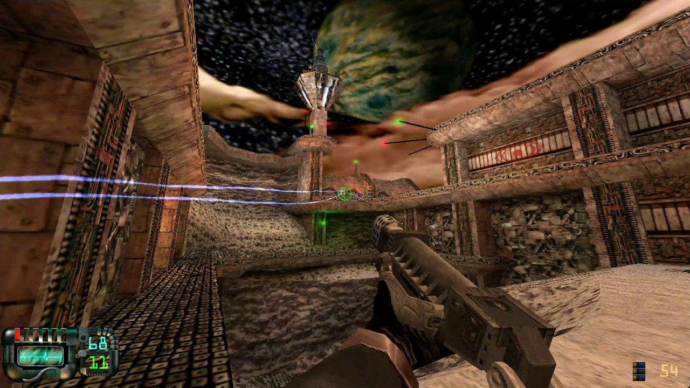 | 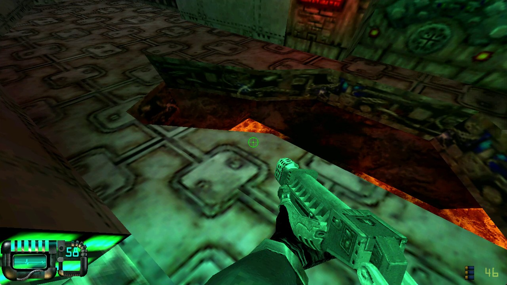 |

From the 81-minute playthrough (1280×960, game DLLs recompiled, the engine
as original code):

| | |
|---|---|
| 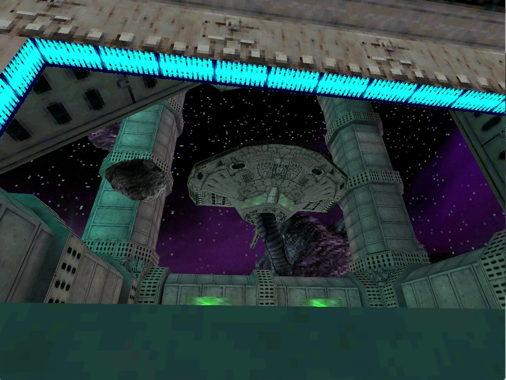 | 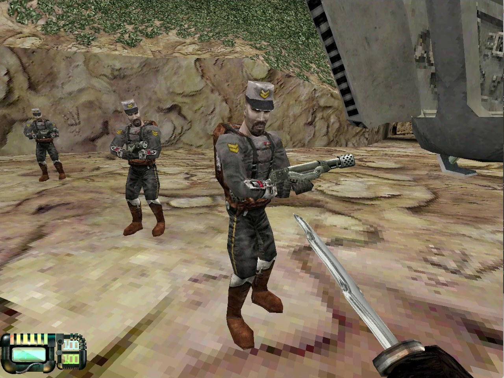 |
| 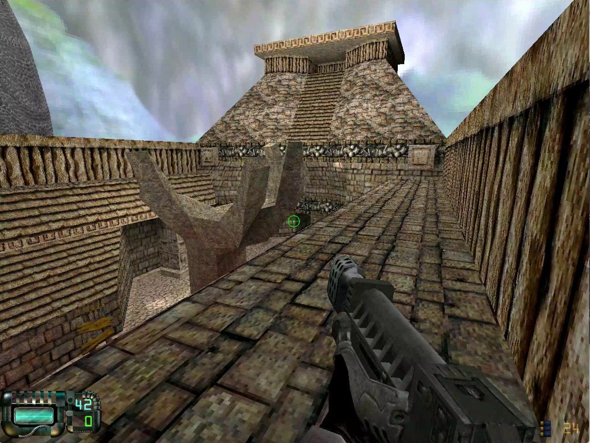 | 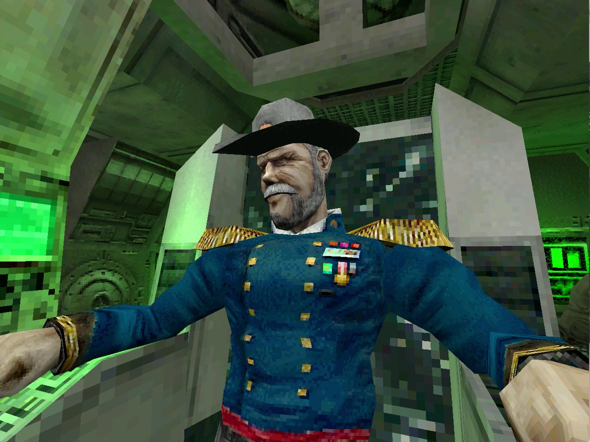 |
| 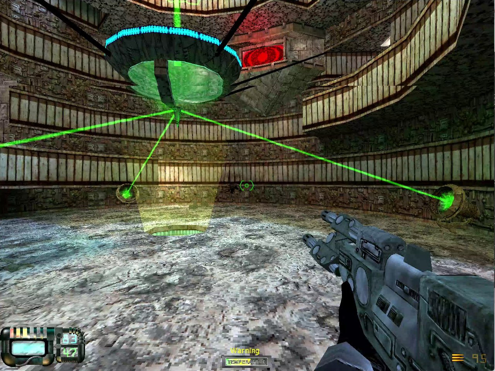 | 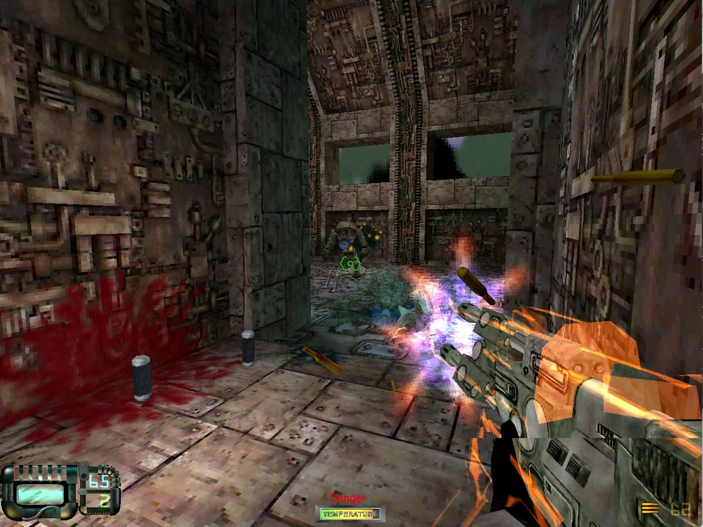 |

**Widescreen**: 1280×720 with the Hor+ view, every module recompiled:

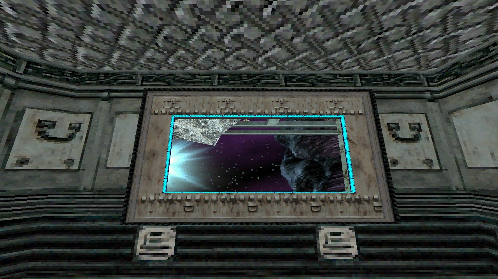

**Filtered textures** (F8): the original texels on the left, our bilinear
span drawer on the right:

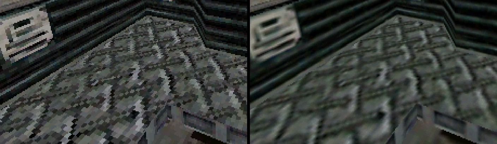

**The CRT look** (F12 to `crt`), scanlines and an aperture grille, at 3×:

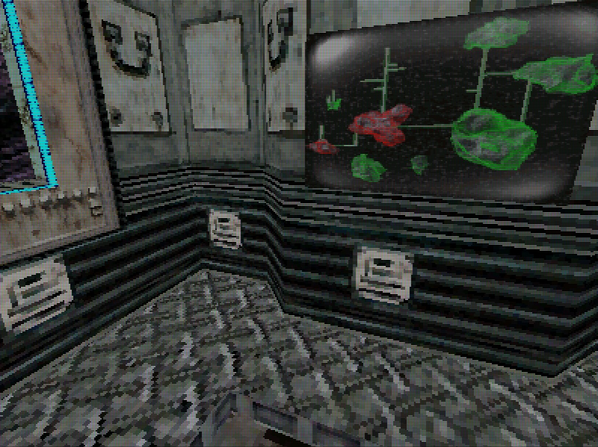

The main menu, drawn by the recompiled launcher after its own boot and intro:

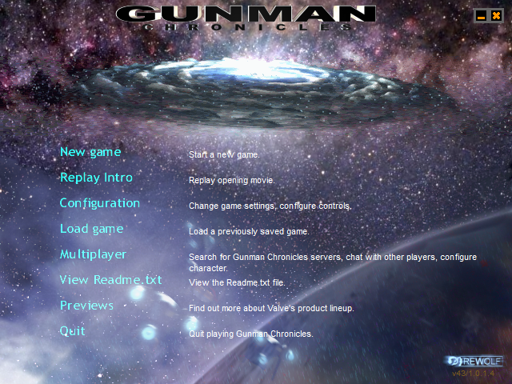

The Sierra intro, mid-boot:

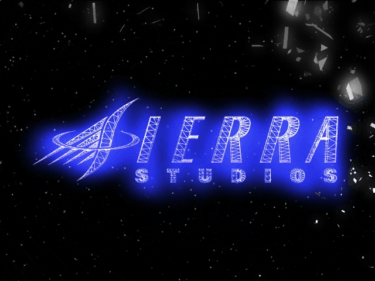

## Getting Started

You need your own Gunman Chronicles CD (the English retail release, launcher
v43/1.0.1.4) and its CD key. Nothing from the game is in this repository.

**Prerequisites** (Windows 10 or 11, x64):

- Visual Studio 2022, any edition, with *Desktop development with C++*. Its x86
  compiler, CMake and Ninja are all this needs.
- Python 3.11 or newer, plus `py -3 -m pip install capstone pefile`
- [Universal Extractor](https://github.com/Bioruebe/UniExtract2), for its
  `E_WISE` Wise unpacker. `tools/install.py` looks in
  `C:\Windows\SysWOW64\UniExtract\bin\`. Set `E_WISE=` if yours is elsewhere.
- Git

**Steps:**

1. Clone this repo and pcrecomp **side by side**. The build looks for
   pcrecomp at `../tools`:
   ```
   git clone https://github.com/sp00nznet/pcrecomp tools
   git clone https://github.com/sp00nznet/gunman
   cd gunman
   ```
2. Install the game from your disc into `game/`. Mount the ISO or insert the CD,
   then run:
   ```
   py -3 tools/install.py D:\
   ```
   Expected: `installed to ...\gunman\game`.
3. Rebase, seed and disassemble (about 10 minutes):
   ```
   py -3 tools/analyze.py
   ```
   Expected, last lines: `Byte coverage: ... (93.4% of code range)` and a
   written `analysis/vgui.functions.json`.
4. Lift to C (about 30 seconds):
   ```
   py -3 run_lift.py
   ```
   Expected: `lifted 21990 functions, 0 errors, 55 files, 3,385,758 lines`.
5. Build (3.4M lines through MSVC; allow a while):
   ```
   build.cmd
   ```
   Expected: `Linking C executable gunman.exe`.
6. Run it, fully recompiled:
   ```
   build\gunman.exe game
   ```
   (`--native sw.dll` runs the engine as its original code instead: that's the
   configuration of the 81-minute playthrough.)
   Expected on stderr:
   ```
   [link] gunman.exe  481 native    59 guest   15 shimmed
   [link] vgui.dll    120 native     0 guest    7 shimmed
   [boot] vgui.dll DllMain -> 1
   [boot] gunman.exe entry 0x00480702  cmdline "...\game\gunman.exe"
   ```
   On the first run, the game asks for your CD key in its own VGUI prompt,
   just as the original does. Then it plays the Sierra logo and the Rewolf
   intro, which runs 3 min 48 s (Esc skips it, as in the original), and shows
   the main menu. *New game* starts the first map.

## Usage

```
build\gunman.exe <game dir> [--rebased DIR] [--imports] [-- guest arguments]
```

| Flag | |
|---|---|
| `<game dir>` | your install, as `tools/install.py` laid it out |
| `--rebased DIR` | where `tools/rebase.py` wrote the rebased images (default `work/rebased`) |
| `--imports` | log every call into Windows: name, arguments, any string argument, result |
| `--press VK@S`, `--click X,Y@S` | scripted input with a virtual cursor; the real mouse and keyboard are never touched |
| `--scale sharp\|smooth\|crt\|nearest\|integer`, `--look natural\|vivid`, `--filter on\|off`, `--fullscreen`, `--gdi`, `--no-present` | our presenter, on the GPU (Direct3D 11, GDI as fallback): the window resizes and the frame scales to fit. **F11** / Alt+Enter borderless fullscreen, **F12** scaling (sharp-bilinear by default), **F9** colour, **F8** filtered textures |
| `--modes WxH,...`, `--fov-original` | the video modes the launcher offers (by default 4:3 plus 1024x576, 1280x720, 1280x800; `original` for the game's own) and the engine's own FOV instead of Hor+ widescreen |
| `--fps`, `--profile N` | frames per second from the engine's own counter; a sampling profile of the lifted functions every N seconds |
| `--native M`, `--pageheap`, `--watchdog N`, `--import-stats`, `--trace-import NAME@S`, `--callbacks` | the diagnostics that got it in game; see [docs/ingame.md](docs/ingame.md) |
| `-- ...` | passed to the game as its own command line |

`tools/run.ps1` boots it for a fixed time, then screenshots the game's window
(only its window) to `work/shot.png`:

```
powershell -File tools/run.ps1 -Seconds 320          # boot, intro, menu
powershell -File tools/run.ps1 -Seconds 20 -Imports   # with the call trace
powershell -File tools/run.ps1 -Native                 # the RETAIL exe, same install: ground truth
powershell -File tools/run.ps1 -Seconds 150 -ShotEvery 15 -Press "0x1B@14 0x1B@24" -Click "110,189@32 85,182@44"
                                                       # boot, skip the intros, New game, Medium, a lit/black timeline
```

`tools/disat.py 0x00480B80` disassembles any lifted module at a VA.

## Building from source

Steps 3 to 5 above are the build. What each stage does, and why the host is
32-bit, is in [docs/architecture.md](docs/architecture.md). What it took to
get from the entry point to the menu, with the failures the runtime printed,
is in [docs/boot.md](docs/boot.md).

Generated source is **not distributed**. `src/recomp/gen/`, `work/`,
`analysis/` and `game/` are gitignored, because all of them are derived from
the retail binaries. You regenerate them from your own copy.

## License

The code and documentation here are MIT: see [LICENSE](LICENSE). Its Scope
section explains that the grant covers our own work only. It doesn't extend to
Gunman Chronicles, the GoldSrc engine, or anything lifted from them.

Gunman Chronicles © 2000 Rewolf Software / Sierra Studios. This project neither
contains nor distributes any part of it, and is not affiliated with or endorsed
by Valve, Activision or any rights holder.
